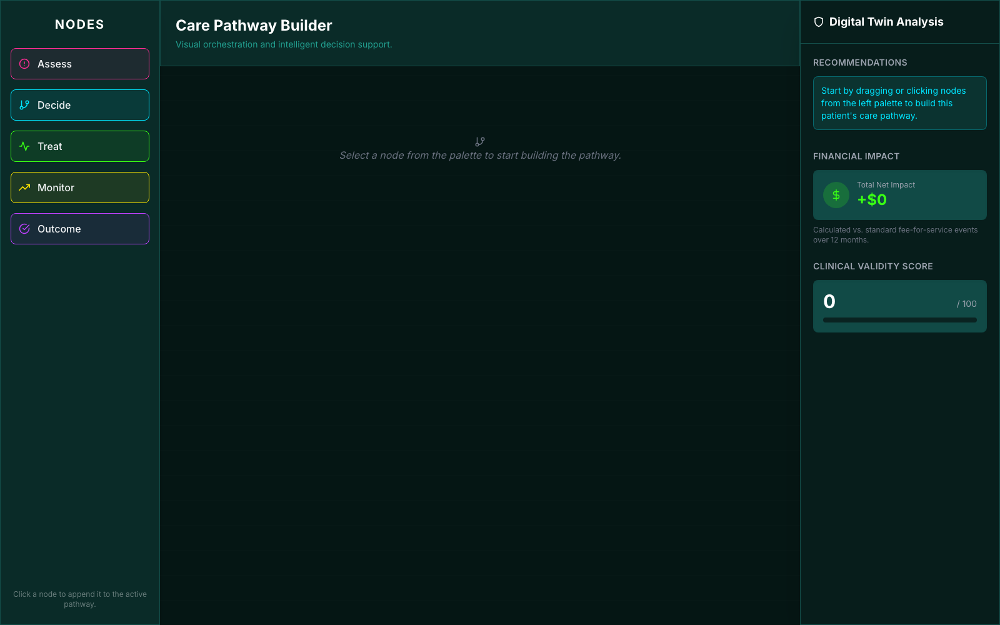

# Care Pathway Builder

Visual orchestration for clinical care pathways, with live digital-twin analysis (clinical validity, cost impact, recommendations).

**Live demo:** https://mvh-mindspan.github.io/pathway-builder/



## What's inside

- **Node palette** — Assess, Decide, Treat, Monitor, Outcome
- **Pathway canvas** — click a node to append it; configure per-node fields inline
- **Digital twin panel** — recommendations, financial impact, and a clinical validity score that update as the pathway changes

Single-file prototype: React 18 + Tailwind (both via CDN), no build step.

## Run locally

Open [`index.html`](index.html) in a browser, or serve the folder:

```bash
python3 -m http.server 8000
# then visit http://localhost:8000
```
